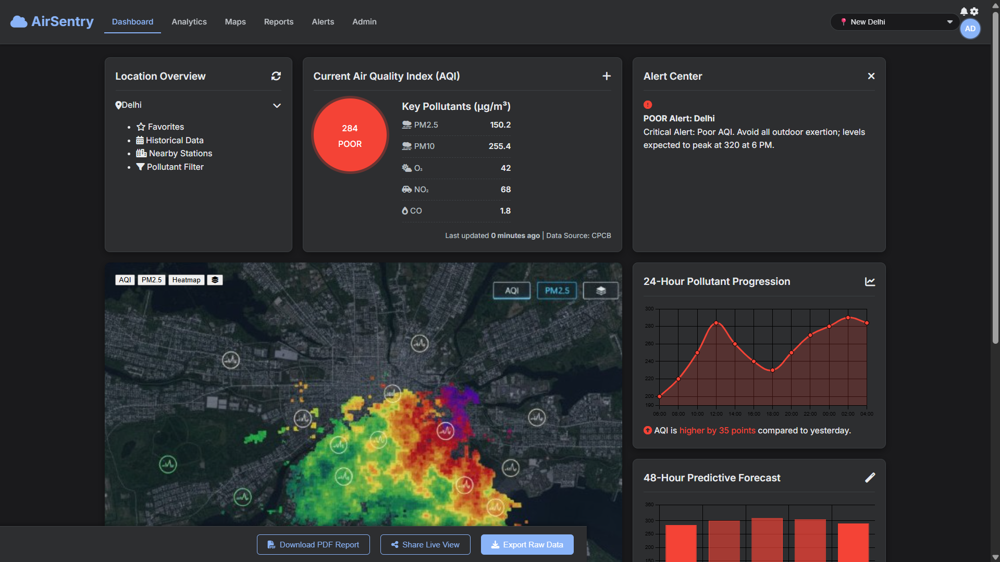
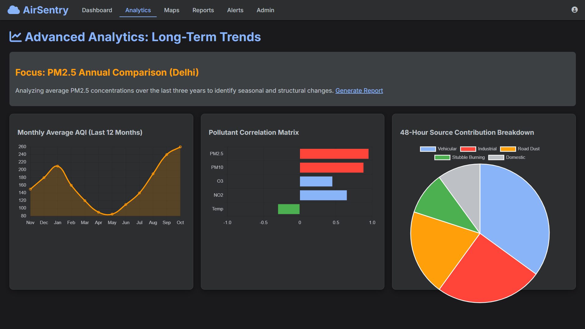
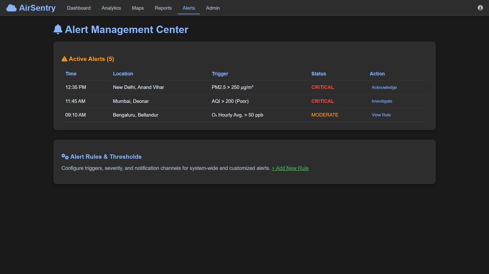

# 🌍 AirSentry: Cloud-Based Air Pollution Monitoring Platform

A scalable, end-to-end IoT system that collects, processes, and visualizes real-time air quality data to empower citizens and policymakers with actionable environmental insights.



## 🚀 Overview

AirSentry tackles the critical challenge of urban air pollution by replacing sparse, expensive monitoring stations with a dense network of low-cost sensors. Our platform provides **street-level, real-time air quality data**, making invisible threats visible and enabling informed decisions for public health and environmental governance.

**Key Highlights:**
- ✅ **Real-time** AQI and pollutant monitoring (PM2.5, PM10, CO)
- ✅ **Interactive Web Dashboard** with maps and historical charts
- ✅ **Automated Email/SMS Alerts** for unhealthy air quality
- ✅ **RESTful API** for developers and researchers
- ✅ **Scalable Cloud Architecture** supporting 500+ sensors
- ✅ **90% more cost-effective** than traditional systems

## 🏗️ System Architecture

Our platform is built on a robust **three-tier architecture**:

### 1. 📡 Data Acquisition Layer (The Edge)
- **Hardware:** ESP32 microcontrollers with PMS5003 (particulate matter) and MQ-series (gaseous pollutants) sensors  
- **Protocol:** Secure MQTT over TLS for reliable data transmission  
- **Frequency:** Data collection every 60 seconds  

### 2. ☁️ Cloud Processing Layer (The Brain)
- **Ingestion:** Google Cloud Functions for serverless data processing  
- **Processing:** Real-time validation, AQI calculation, and anomaly detection  
- **Storage:** Firebase Realtime Database optimized for time-series data  
- **Alerting:** Automated notification system with intelligent throttling  

### 3. 💻 Application Layer (The Interface)
- **Backend:** Flask REST API with secure endpoints  
- **Frontend:** Responsive dashboard with Leaflet.js maps and Chart.js visualizations  
- **Features:** Interactive maps, trend analysis, historical data, and report generation  

## 🛠️ Technology Stack

| Layer | Technologies |
|-------|--------------|
| **Hardware** | ESP32, PMS5003, MQ-7, MQ-135 |
| **Communication** | MQTT over TLS, Wi-Fi |
| **Cloud** | Google Cloud Functions, Firebase Realtime Database |
| **Backend** | Python, Flask, Flask-RESTful |
| **Frontend** | HTML5, CSS3 (Tailwind), JavaScript, Chart.js, Leaflet.js |
| **Alerting** | Twilio API (SMS), SendGrid (Email) |

## 📊 Key Features

### 🌐 Live Air Quality Map
- Color-coded sensors showing current AQI status  
- Interactive markers with detailed pollutant information  
- Geographical heatmaps for pollution visualization  

### 📈 Advanced Analytics
- Historical trend analysis with customizable time ranges  
- Multi-pollutant concentration charts  
- Export capabilities for research and reporting  

### 🔔 Smart Alert System
- Configurable thresholds for different pollutants  
- Multi-channel notifications (Email, SMS)  
- Intelligent throttling to prevent alert fatigue  

### 🔧 Open Data API
- RESTful endpoints for real-time and historical data  
- API key authentication and rate limiting  
- Developer-friendly documentation  

## 🎯 Project Impact

- **Public Health:** Enables vulnerable groups to make informed decisions about outdoor activities  
- **Policy Making:** Provides high-resolution data for targeted environmental interventions  
- **Research:** Offers large-scale, high-frequency datasets for atmospheric studies  
- **Transparency:** Democratizes environmental data access for communities  

## 🚦 Getting Started

### Prerequisites
- Python 3.8+  
- Node.js (for frontend development)  
- Google Cloud Account  
- Firebase Project  

### Installation
```bash
# Clone the repository
git clone https://github.com/yourusername/airsentry-platform.git

# Install backend dependencies
cd backend
pip install -r requirements.txt

# Install frontend dependencies
cd ../frontend
npm install

# Configure environment variables
cp .env.example .env
# Add your API keys and configuration
```
## 🚀 Deployment

1. **Set up** Firebase Realtime Database  
2. **Configure** Google Cloud Functions for data processing  
3. **Deploy** Flask backend to your preferred cloud provider  
4. **Host** frontend on a web server or CDN  

---

## 📸 Screenshots

| Real-time Dashboard | Analytics Interface | Alert Management |
|---------------------|-------------------|------------------|
|  |  |  |

---

## 📈 Performance Metrics

- **Latency:** <10 seconds end-to-end data pipeline  
- **Scalability:** 500+ simultaneous sensor connections  
- **Accuracy:** <5 μg/m³ MAE for PM2.5 after calibration  
- **Uptime:** 99.9% service reliability  
- **Cost:** ~₹1,500/month for 100 sensor nodes  

---

## 🤝 Contributing

We welcome contributions! Please feel free to submit pull requests, report bugs, or suggest new features.

1. **Fork** the repository  
2. **Create** your feature branch (`git checkout -b feature/AmazingFeature`)  
3. **Commit** your changes (`git commit -m 'Add some AmazingFeature'`)  
4. **Push** to the branch (`git push origin feature/AmazingFeature`)  
5. **Open** a Pull Request  

---

## 📄 License

This project is licensed under the **MIT License** – see the [LICENSE](LICENSE) file for details.

---

## 👥 Team

- **Jinto Joseph** – [URK24CS1210]   

---

## 🙏 Acknowledgments

- Karunya Institute of Technology and Sciences  
- Project Guide: *Ms. Roshini R*  
- Open-source libraries and cloud service providers  
- Environmental research communities worldwide  
